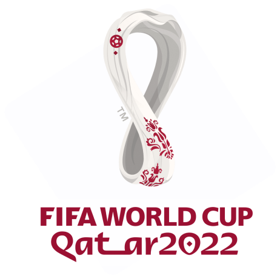

#  PeCopa 2022 

## Descrição

Aplicação para realizar palpites ou apostas de placares dos jogos da Copa do Mundo de 2022 no Catar.

## Funcionalidades

### Usuário

- [x] Cadastro
- [x] Login
- [x] Verificação de E-mail
- [x] Edição de Perfil
- [x] Recuperação de Senha

### Aplicação

- [x] Fase de Grupos
- [x] Fase de Mata-mata
- [x] Criação de Palpites
- [x] Compartilhamento de Palpites
- [x] Listagem de Participantes

## [Layout Figma][figma]

## Tech

- [Vite][vite]
- [TailwindCSS][tailwind]
- [Yup][yup]
- [axios][axios]
- [Formik][formik]
- [date-fns][date-fns]
- [react-use][react-use]
- [react-icons][react-icons]
- [react-toastify][react-toastify]
- [react-loader-spinner][react-loader-spinner]

## Créditos

Projeto foi realizado no evento Input da [Codar.me](https://codar.me/input)

[prisma]: https://www.prisma.io
[dotenv-safe]: https://www.npmjs.com/package/dotenv-safe
[jsonwebtoken]: https://www.npmjs.com/package/jsonwebtoken
[axios]: https://axios-http.com
[date-fns]: https://date-fns.org
[koa]: https://koajs.com
[bcrypt]: https://www.npmjs.com/package/bcrypt
[vite]: https://vitejs.dev
[formik]: https://formik.org
[tailwind]: https://tailwindcss.com
[yup]: https://github.com/jquense/yup
[react-icons]: https://react-icons.github.io/react-icons
[react-toastify]: https://github.com/fkhadra/react-toastify#readme
[react-loader-spinner]: https://mhnpd.github.io/react-loader-spinner
[react-use]: https://www.npmjs.com/package/react-use
[figma]: https://www.figma.com/file/SgGHrC5RvFJoeHo0lrQRKM/Projeto-%E2%80%A2-PeCopa-2022?node-id=0%3A1
